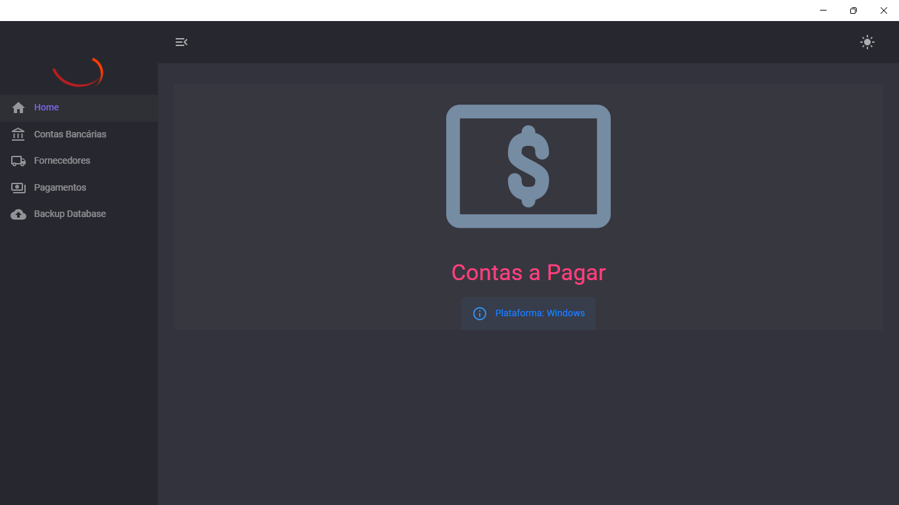
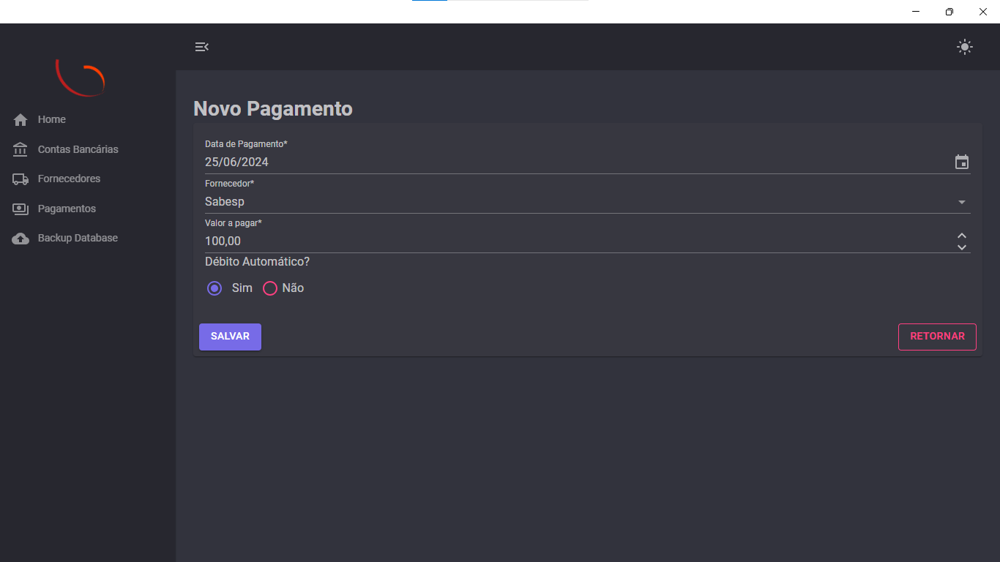
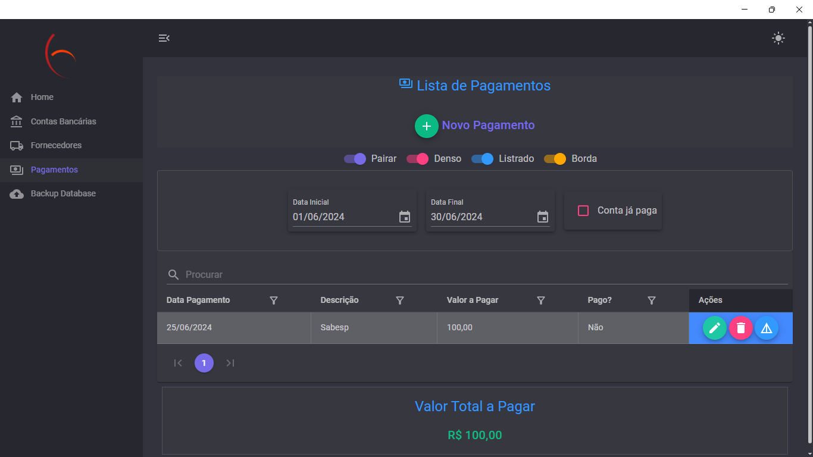
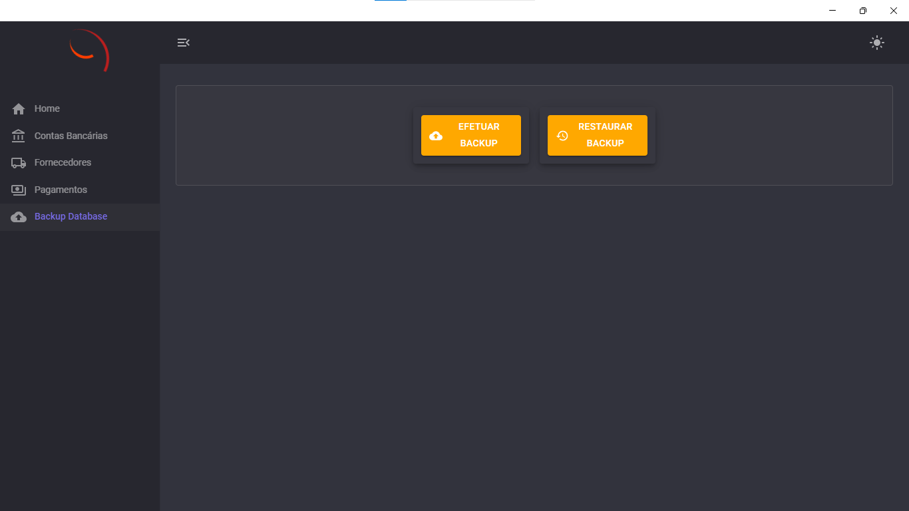
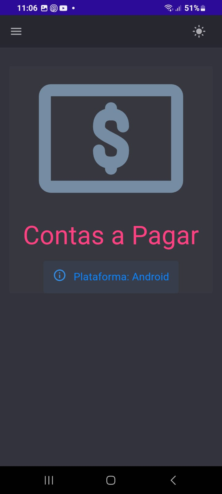
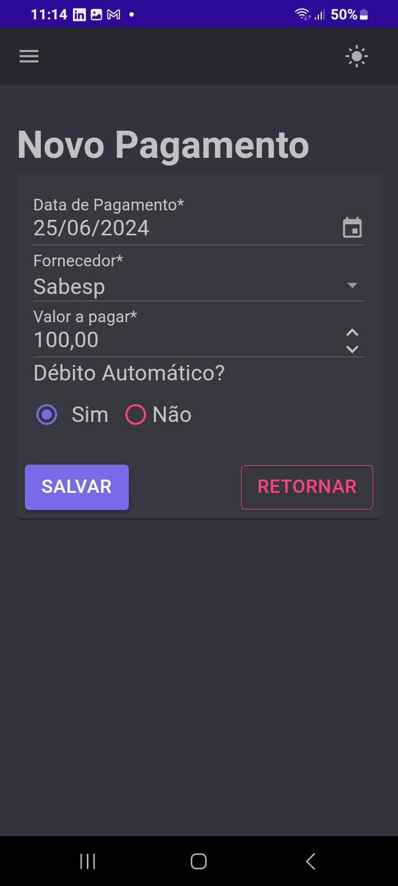
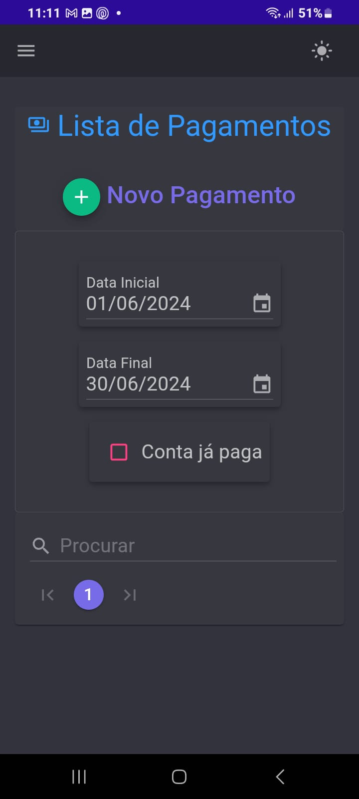
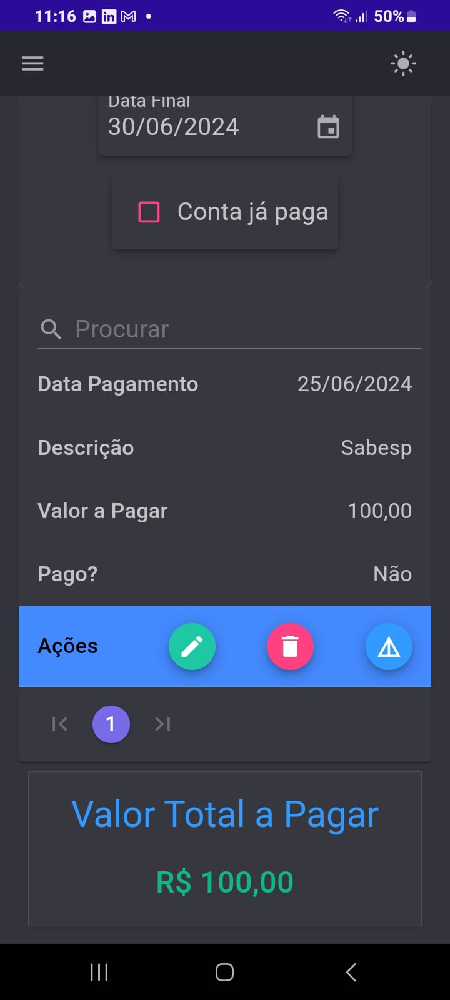
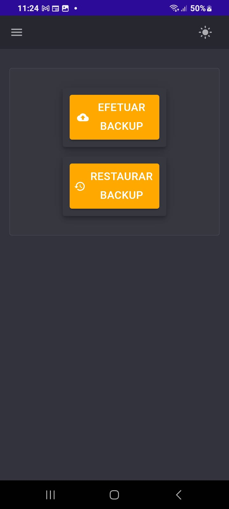

# ContasPagar
## App Contas a Pagar para uso pessoal

Um software de contas a pagar pessoal é uma ferramenta projetada para ajudar indivíduos a gerenciar suas obrigações financeiras. 

# Propósito:

Ajudar usuários a acompanhar faturas e pagamentos pendentes.
Organizar despesas por categorias, como contas domésticas, empréstimos e serviços.

# Características Principais:

Registro de Pagamentos: Permite inserir detalhes de contas, como credor, valor, data de vencimento e descrição.

Segurança: Opção de fazer backup e restaurar base de dados.

Útil para manter as finanças pessoais organizadas e evitar o esquecimento de pagamentos importantes.

# Futuras implementações

Permitir adicionar pagamentos recorrentes.

Segurança: Proteção de dados com criptografia.

Lembretes de Pagamento: Notificações automáticas para evitar atrasos e multas por pagamentos em atraso.

Relatórios Financeiros: Geração de relatórios para visualizar gastos e ajudar no planejamento financeiro.

# Técnologias Utilizadas
Banco de dados: SQLite

Linguagem: C#

Aplicativo criado em Blazor Hybrid

# Telas do Aplicativo 

## Desktop 

## Mobile

